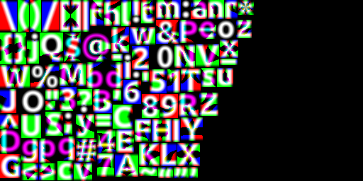

# Lightning 3 SDF Font Generator



This tool converts font files (.ttf, .otf, .woff, woff2) to Signed Distance Field (SDF) fonts for use with the Lightning 3's SDF text renderer. As an additional feature, this utility also generates the recommended font metrics for use in the configuration of SDF and Canvas Web fonts.

Both multi-channel (MSDF) and single-channel (SSDF) font files are generated.

See the following resources for more information about SDF font rendering:
- https://lightningjs.io/blogs/lng3FontRendering.html
- https://github.com/Chlumsky/msdfgen?tab=readme-ov-file#multi-channel-signed-distance-field-generator

This tool uses [msdf-bmfont-xml](https://github.com/soimy/msdf-bmfont-xml) to generate the font JSON data and texture atlases. And also applies some adjustments to that JSON data.

## Setup

1. Make sure you have Node.js installed on your system. Then, run the following command to install dependencies:

```
pnpm install
```

2. Copy the `font-src-sample` directory to `font-src`:

```
cp -R font-src-sample font-src
```

## Instructions

1. Copy Fonts: Place all the font files you want to convert to SDF fonts into the `font-src` directory.

2. Generate SDF Textures: Run the following command to generate SDF textures from the font files:

```
pnpm generate
```

3. Access Generated Files: The generated SDF font files will be available in the `font-dst` directory.

## Font Metrics Generation

In addition to generating SDF fonts, this tool also generates the recommended
metrics configuration for use in both SDF and Canvas Web fonts. After running
the tool, the metrics extracted from each scanned font will be placed in the
`font-dst/metrics/` directory. An example is below.

**font-dst/metrics/Ubuntu-Regular.metrics.json**
```json
{
  "ascender": 776,
  "descender": -185,
  "lineGap": 56,
  "unitsPerEm": 1000
}
```

These metrics can then be configured directly into the font face definitions
in the Renderer Core Extension. If your app needs to support both Canvas and
SDF versions of the same font for any reason, it is important that they are both
configured with the same `metrics` configuration to ensure maximum layout parity
between the SDF and Canvas Text Renderers.

**CoreExtension.ts**
```ts
// ...
stage.fontManager.addFontFace(
  new WebTrFontFace({
    fontFamily: 'Ubuntu',
    descriptors: {},
    fontUrl: '/fonts/Ubuntu-Regular.ttf',
    metrics: {
      ascender: 776,
      descender: -185,
      lineGap: 56,
      unitsPerEm: 1000,
    },
  }),
);

stage.fontManager.addFontFace(
  new SdfTrFontFace('msdf', {
    fontFamily: 'Ubuntu',
    descriptors: {},
    atlasUrl: '/fonts/Ubuntu-Regular.msdf.png',
    atlasDataUrl: '/fonts/Ubuntu-Regular.msdf.json',
    stage,
    // NOTE: Providing these metrics for SDF fonts is optional because
    // they are encoded by this tool into the atlas data JSON data
    // itself (see the `lightningMetrics` key). If you decide to use
    // values that are different from the generated default you can
    // insert them here.
    metrics: {
      ascender: 776,
      descender: -185,
      lineGap: 56,
      unitsPerEm: 1000,
    },
  }),
);
// ...
```

The default recommended metrics come directly from the font file itself and may
be tweaked as needed by the developer. Be sure to apply any tweaks to both the
SDF and Canvas Web versions of the fonts equally if both versions are required
by your application to ensure consistent text layout between SDF and Canvas
Text Renderers.

## Adjusting the Charset

The contents of `font-src/charset.txt` can be modified to adjust the characters
that are included into the SDF font.

## Overrides (Advanced)

By default this tool will generate SDF fonts with these properties:
- Font Size (pixels): 42
  - This is the size of the font that is rendered into the atlas texture PNG.
  - Generally bigger values result in clearer fonts with less potential of artifacts. However, bigger values can also dramatically increase the size of the texture so keep this value as small as possible if you make adjustments.
- Distance Range: 4
  - The distance range defines number of pixels of used in rendering the actual signed-distance field of the atlas texture.
  - Generally this value shouldn't have to be adjusted, but feel free to tweak along with the font size in order to get the highest quality text rendering with the smallest atlas texture size. It **must** be a multiple of 2.

For each font file in the `font-src` directory you can define overrides for these values in the `font-src/overrides.json` file.

Below is an example of overriding font size and distance range for the Ubuntu-Regular font.

```
{
  "Ubuntu-Regular": {
    "msdf": {
      "fontSize": 45
      "distanceRange": 6
    },
    "ssdf": {
      "fontSize": 50
      "distanceRange": 6
    }
  }
}
```
